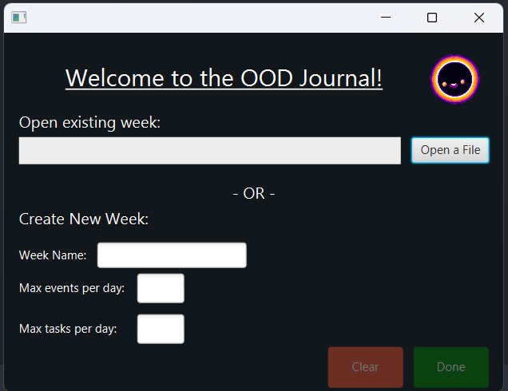
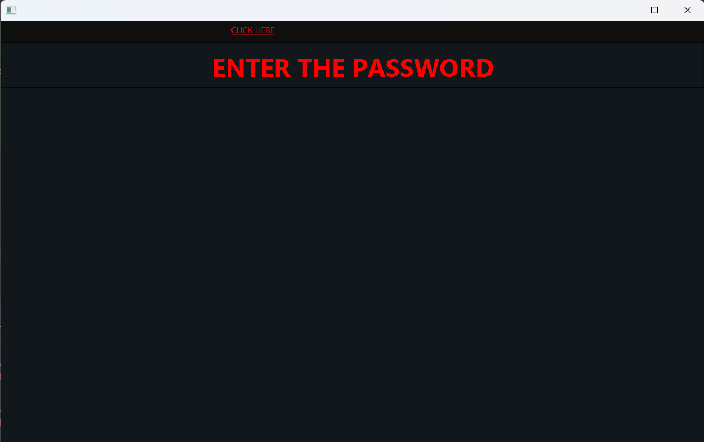
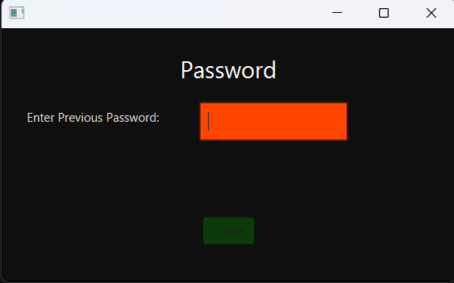
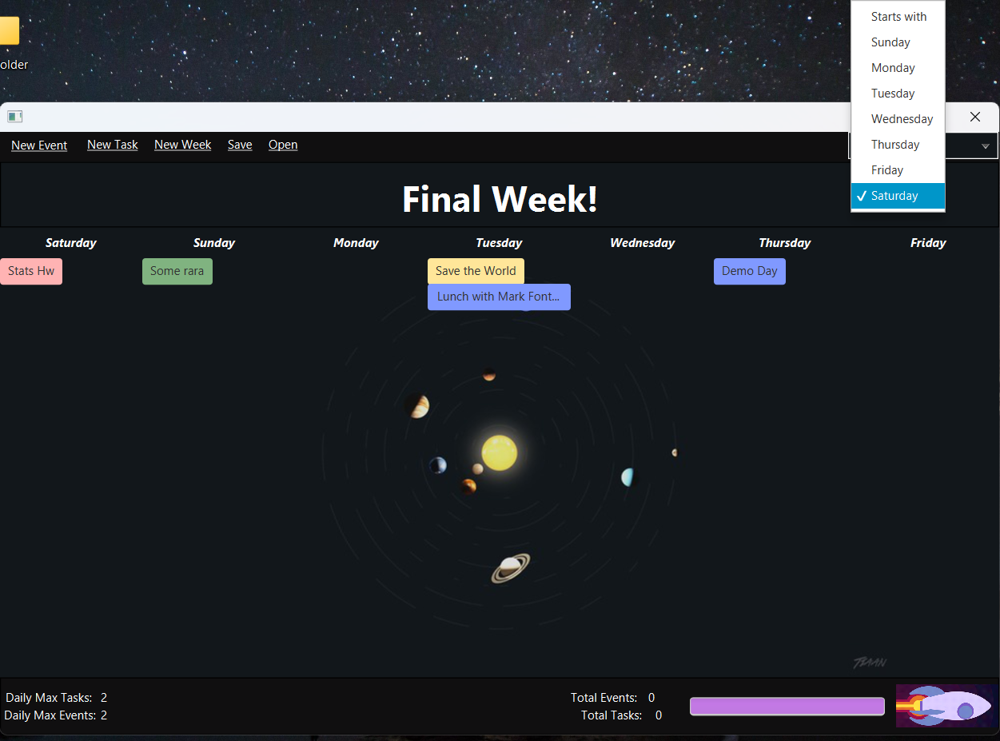
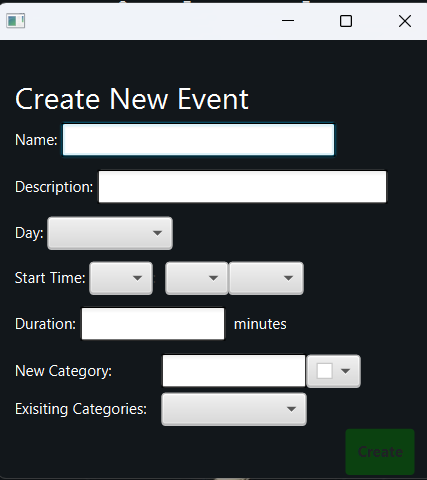
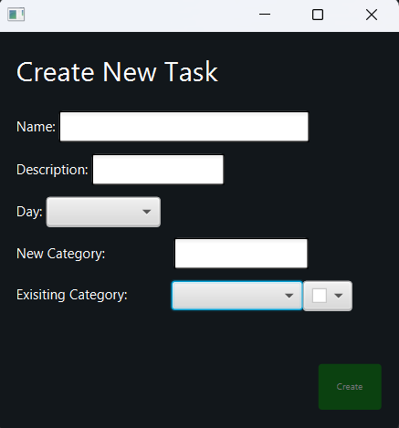
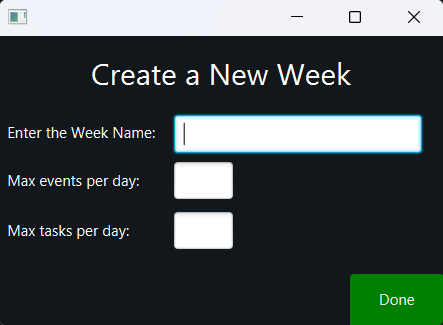
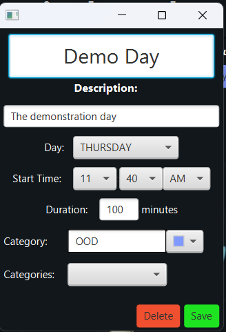
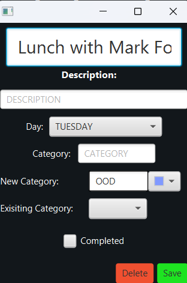

## Program Pitch
Stay organized and maximize productivity with WeekPlan. This app offers a streamlined interface to create, edit, 
and manage events and tasks for the week. Customize categories, save and load pre-existing weeks, and enjoy keyboard 
shortcuts for seamless navigation. Get a detailed view of each task, a weekly overview, and choose your preferred week
start day. Take control of your schedule with WeekPlan—download now!

## GUI Screenshots

## SOLID Principles
- S: we applied the Single Responsibility principle by having each window use its own controller, for example, 
the mini viewer controllers for events and tasks have their own classes. Each class controls its own mini viewer and stage,
so that they do not interrupt each other. For the new event and new task controllers, each class handles making only
its appropriate type of bullet, but are abstracted through an interface since they have similar functionality.

- O: we applied the Open/Closed principle through the use of abstraction. In our model, we abstracted events and tasks
to be classified as EventBullets and TaskBullets, respectively, which extend AbstractBullet. These then implement the
interface, Bullet. This means that we would not have to modify event or task in order to add more features. Because we
have multiple levels of abstraction, we can implement other types of bullets in the future if we choose to do so.

- L: we applied the Liskov Substitution principle in many cases. We used different data structures involving Bullets 
which meant they could be an EventBullet or TaskBullet. In most cases, we can replace a generic Bullet with an EventBullet
or TaskBullet without changing the way the code works.

- I: we applied the Interface Segregation principle when creating our controller interfaces. Each controller interface
has a specific level of functionality that only gets used when it needs to. There are many interfaces so that no classes
that implement an interface do not use its methods. This ensures differentiation between our controller classes and reduces
ambiguity.

- D: we applied the Dependency Inversion principle by abstracting code with interfaces in multiple places. In the model,
we used the Bullet, EventBullet and TaskBullet interfaces. In the controller, we made use of several interfaces to abstract
the different purposes for each controller. Both of these ensure that the high-level modules are not dependent on the low-level
modules

## Extending Program for Additional Features
We could extend our program in the future to have the additional feature of themes, since we can use CSS files to color,
organize, and format our week view. Right now, we have limited use of CSS files to set background images and since we have
these files readily available, they can be expanded upon to include other properties like colors for the different elements
in our scenes.

## Image Credits
https://wallpaperaccess.com/minimalist-space
https://giphy.com/stickers/kurzgesagt-loop-kurzgesagt-in-a-nutshell-inanutshell-y8tLxq4uGuIWFFIOQW
